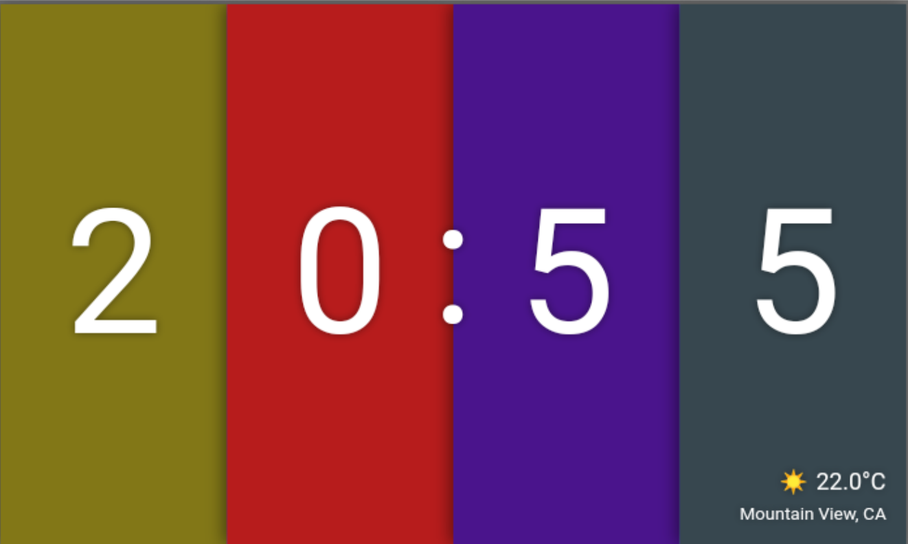
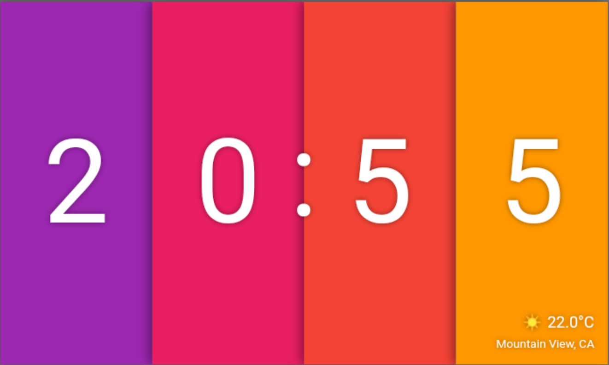

# Layers of color Clock

Clock created to participate in the Flutter clock challenge. (https://flutter.dev/clock)
It has a light theme and a dark theme.

Every time that a number changes, the associated layer changes its color, and the number let's the new number occupy its place.

